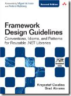

I’ve been thinking lately about general framework design. Over the next year, we’ll be redesigning the underlying framework of our product for just about every level. Given this undertaking and my strong desire to make sure it’s designed in the most flexible and extensible way, I’m looking for principles that we can apply to our code.

I think “[Framework Design Guidelines](http://www.amazon.com/gp/product/0321545613)” by Krzysztof Cwalina and Brad Abrams is the resource I’m looking for. According to the book, it “teaches developers the best practices for designing reusable libraries for the Microsoft .NET Framework. Expanded and updated for .NET 3.5, this new edition focuses on the design issues that directly affect the programmability of a class library, specifically its publicly accessible APIs.”

I’m excited by the coverage of new .NET framework features. Hopefully I can glean some good patterns and practices that will help us create a solid and reusable foundation for our product. I plan on requesting the book for our company, so I’ll let you know once I’ve had some hands-on time with it.
 

